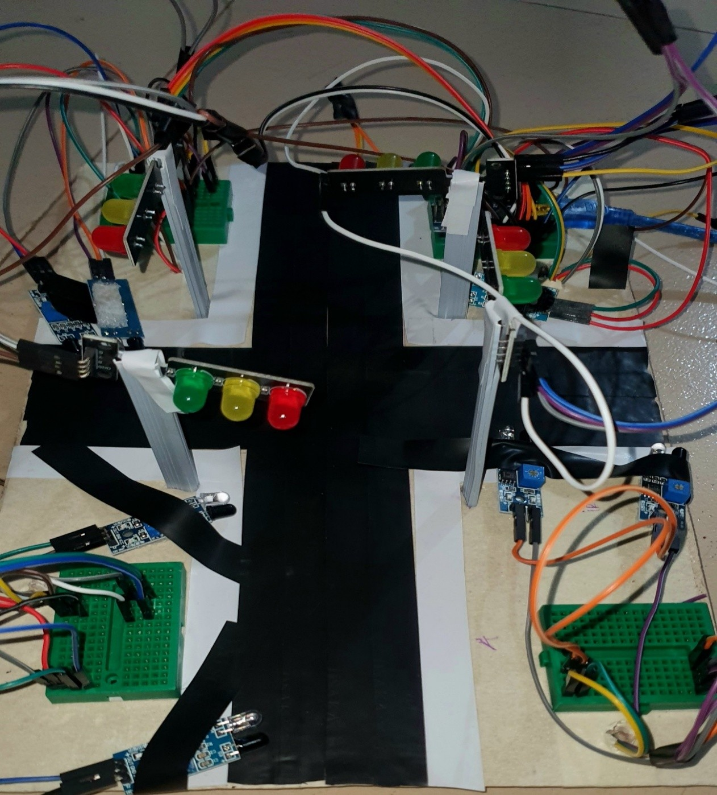
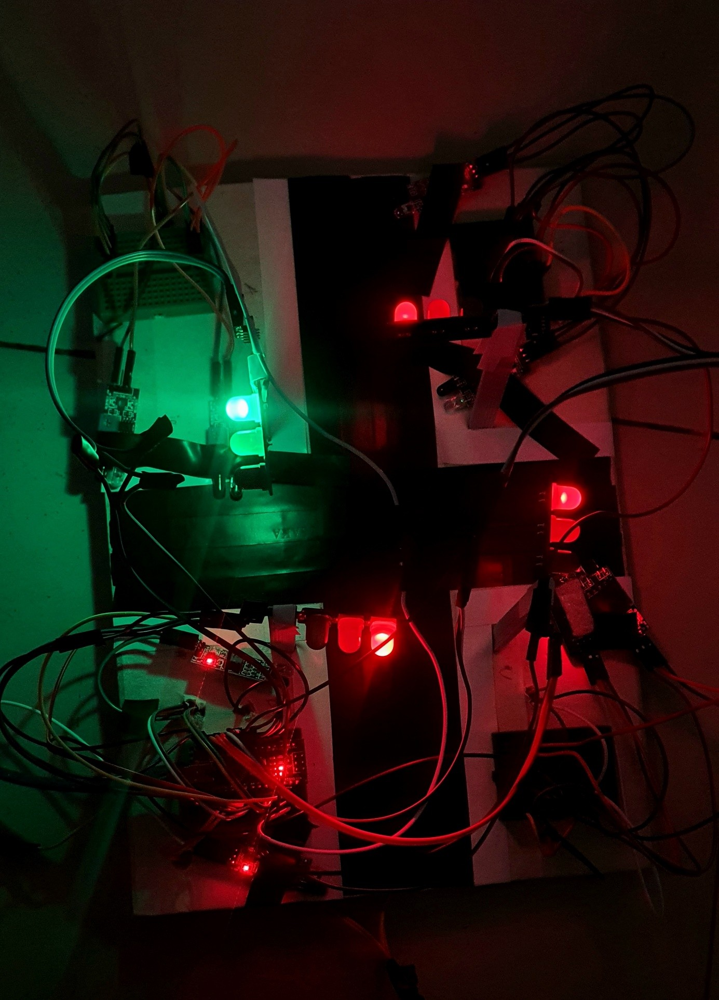

# 🚦 Density-Based 4-Way Automatic Traffic Signal Control System

A microcontroller-based traffic signal control prototype that uses IR sensors to detect traffic conditions and dynamically control traffic signals at a four-way intersection.

## 📌 Overview

The **Density-Based 4-Way Automatic Traffic Signal Control System** was developed as an embedded systems project to demonstrate sensor-based traffic signal control.

The system uses IR sensors to monitor traffic conditions on four approaches of an intersection. An Arduino Nano processes the sensor inputs and applies predefined decision logic to determine which road should receive the green signal.

Unlike a purely fixed-sequence traffic signal, the prototype considers sensor input when selecting signal priority.

## 🎯 Objectives

* Detect traffic conditions using IR sensors.
* Process sensor inputs using an Arduino Nano.
* Dynamically determine traffic signal priority.
* Control red, yellow, and green traffic LEDs.
* Demonstrate sensor-based automation using an embedded controller.
* Develop a low-cost prototype for studying adaptive traffic signal control.

## 🧩 System Architecture

```text
Traffic Detection
       │
       ▼
   IR Sensors
       │
       ▼
  Arduino Nano
       │
       ▼
 Decision Logic
       │
       ▼
Signal Priority
       │
       ▼
Traffic Light LEDs
```

## ⚙️ How It Works

1. IR sensors monitor the traffic conditions of the four approaches.
2. The Arduino Nano receives the sensor signals.
3. The controller evaluates the sensor states using predefined decision logic.
4. Based on the detected conditions, a road is selected for signal priority.
5. The selected road receives the green signal.
6. The corresponding yellow and red signals are controlled during signal transitions.
7. The process continues continuously while the system is powered.

## 🔧 Hardware Components

* Arduino Nano
* IR sensors
* Red, yellow, and green LEDs
* 220Ω resistors
* Jumper wires
* Breadboard / prototype board
* USB / regulated power supply
* Supporting structural materials

## 💻 Technologies

* **Programming Language:** C/C++
* **Microcontroller:** Arduino Nano
* **Sensors:** IR sensors
* **Development Environment:** Arduino IDE
* **Electronics:** LEDs, resistors, jumper wires

## 🔌 Circuit Diagram


## 📷 Project Prototype

### Prototype Before Power Supply



### Completed Prototype



## 🧠 Control Logic

The controller evaluates the sensor conditions associated with the four roads and activates the appropriate traffic signal-control routine.

The implementation contains separate control routines for the four roads, allowing the corresponding traffic signals to be activated according to the detected traffic conditions.

## 🧪 Testing

The prototype was tested under different simulated traffic conditions to verify:

* IR sensor response.
* Sensor-to-controller communication.
* Traffic signal LED operation.
* Road-priority selection.
* Correct red, yellow, and green signal transitions.

## 🚀 Future Improvements

Potential extensions of the prototype include:

* Camera-based vehicle detection.
* Computer vision for traffic-density estimation.
* Machine learning-based traffic prediction.
* IoT-based remote monitoring.
* Emergency vehicle priority.
* Pedestrian detection.
* Multi-intersection coordination.
* Solar-powered operation.

## 📚 Documentation

The complete academic project report is available here:

[`project-report.pdf`](documentation/project-report.pdf)

## 👨‍💻 Project Information

**Project:** Density-Based 4-Way Automatic Traffic Signal Control System

**Institution:** International University of Business Agriculture and Technology (IUBAT)

**Course:** Logic Design and Switching Circuit Lab (CSC 330)

**Author:** MD Abdul Gaffar

## 📄 License

This project is licensed under the MIT License.
